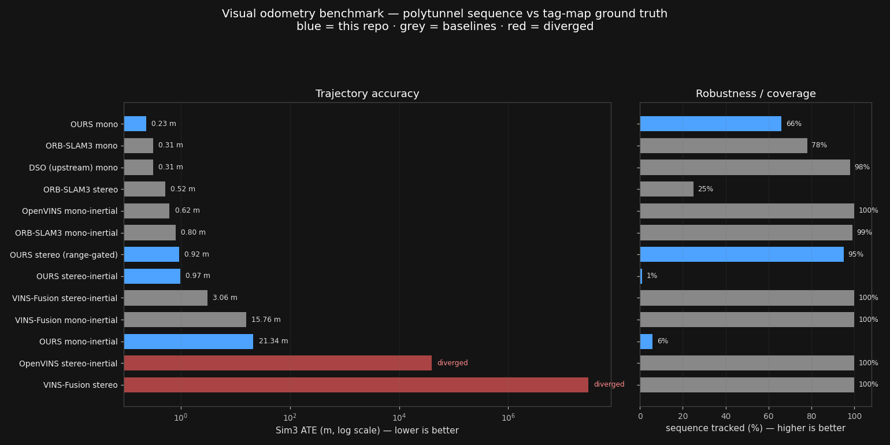
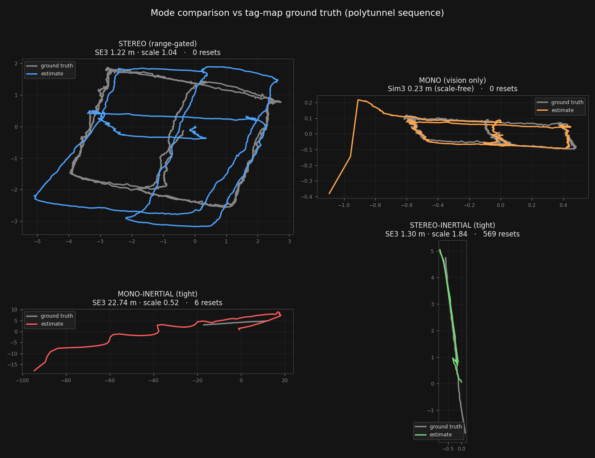
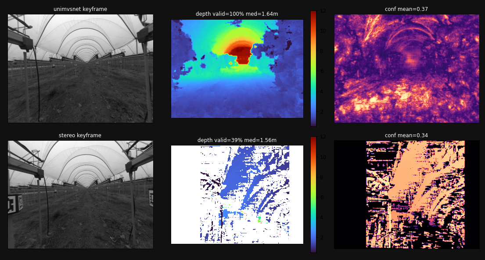

# Direct Sparse(-Inertial) Odometry


Vibe coded DSO ros wrapper with: mono, mono inertial, stereo, stereo inertial, GTSAM style VI fusion,
and **real-time dense reconstruction** (learned multi-view stereo or classical stereo).

Built on [VI-Stereo-DSO](https://github.com/RonaldSun/VI-Stereo-DSO) (included here as a
patched fork — see [Upstream fixes](#upstream-fixes-in-vi-stereo-dso)), with a
GTSAM-based loosely-coupled fusion layer inspired by the design principles of
[OKVIS2](https://github.com/smartroboticslab/okvis2), and a
[dense reconstruction](#dense-reconstruction) stage after
[DSO + MVSNet](https://github.com/shuoyuanxu/Real-time-Pose-Estimation-and-Dense-Reconstruction-Based-on-DSO-and-MVSNet).

## Repository layout

A single ROS1 (catkin) package. Four build targets are produced from it: the
DSO core library, the live odometry node, the fusion node, and the dense mapper.

| Path | What it is |
|---|---|
| `include/` | the direct Stereo/VI-DSO **core** 
| `include/MVS/` | **(ours)** the **MVS engine** — UniMVSNet (upstream `networks/` unmodified) + stereo backend + window assembler, sitting alongside the DSO core |
| `msg/` | **(ours)** `SlidingWindowsMsg` (DSO → MVS), `DepthMsg` (MVS → mapper) |
| `models/` | UniMVSNet pretrained checkpoints (DTU + BlendedMVS, 11 MB each) |
| `src/vi_dso_node.cpp` | **(ours)** live ROS node with four modes (`mono`, `mono_imu`, `stereo`, `stereo_imu`), full RViz visualization, OKVIS-style init relaxations → executable `vi_dso_live` |
| `src/dso_imu_graph_node.cpp` | **(ours)** GTSAM iSAM2 factor graph fusing mono DSO odometry with preintegrated IMU factors → executable `dso_imu_graph_node` |
| `src/dense_mapping_node.cpp` | **(ours)** fuses dense depth into a global voxel-filtered cloud → executable `dense_mapping_node` |
| `scripts/dense_depth_node.py` | **(ours)** dense depth node, backend selectable (`unimvsnet` \| `stereo`) |
| `scripts/` | **(ours)** trajectory recorders + `eval_ate.py` (SE3 + Sim3 Umeyama ATE) + dense capture/GIF tools |
| `thirdparty/` | Sophus + sse2neon headers the core needs |

`vi_dso_live` links `dso_core`; `dso_imu_graph_node` links GTSAM; `dense_mapping_node`
links PCL. All are independent executables in one package — build once, run any.

## Modes

One standalone launch file per mode (each starts the node + RViz):

```bash
roslaunch polytunnel_vio stereo.launch        
roslaunch polytunnel_vio mono.launch          
roslaunch polytunnel_vio mono_graph.launch    # mono + IMU loose fusion
roslaunch polytunnel_vio stereo_graph.launch  # stereo + IMU loose fusion
roslaunch polytunnel_vio mono_imu.launch      # tightly-coupled VI
roslaunch polytunnel_vio stereo_imu.launch    # tightly-coupled stereo-VI

# then, in another terminal:
rosbag play your.bag
```

For odometry **plus** a dense map, use the `dense_*` launches instead — see
[Dense reconstruction](#dense-reconstruction).

## Results (polytunnel sequence, tag-map ground truth, ~343 s)

| System | Modality | SE3 ATE | Sim3 ATE | scale | coverage |
|---|---|---|---|---|---|
| **OURS mono** | mono | — scale-free | **0.23 m** | — | 66 % \* |
| ORB-SLAM3 | mono | — scale-free | 0.31 m | — | 78 % |
| DSO (upstream) | mono | — scale-free | 0.31 m | — | 98 % |
| ORB-SLAM3 | stereo | 0.64 m | 0.52 m | 1.03 | 25 % |
| OpenVINS | mono-inertial | **0.63 m** | 0.62 m | 0.99 | 100 % |
| ORB-SLAM3 | mono-inertial | 0.86 m | 0.80 m | 1.02 | 99 % |
| **OURS stereo (range-gated)** | stereo | **1.22 m** | **0.92 m** | **1.04** | **95 %** |
| OURS stereo-inertial | stereo-inertial | 1.30 m | 0.97 m | 1.84 | 1 % |
| VINS-Fusion | stereo-inertial | 3.19 m | 3.06 m | 1.05 | 100 % |
| VINS-Fusion | mono-inertial | 15.9 m | 15.8 m | 0.89 | 100 % |
| OURS mono-inertial | mono-inertial | 22.7 m | 21.3 m | 0.52 | 6 % |
| OpenVINS | stereo-inertial | *diverged* | *diverged* | 0.00 | 100 % |
| VINS-Fusion | stereo | *diverged* | *diverged* | 0.00 | 100 % |

<<<<<<< HEAD
Reading it honestly: **OpenVINS mono-inertial is the most accurate metric system** (0.63 m,
full coverage) and our range-gated stereo is competitive at 1.22 m / 95 % without using the
IMU at all. **Our mono has the best trajectory *shape* of any system tested** (Sim3 0.23 m,
beating both ORB-SLAM3 mono and upstream DSO at 0.31 m) — it just carries no metric scale.
Two baselines fail outright on this sequence (OpenVINS stereo-inertial and VINS-Fusion
stereo both diverge), and ORB-SLAM3 stereo's excellent 0.64 m covers only a quarter of
the run before it loses tracking.

**The winner is range-gated stereo, no IMU needed** (SE3 0.88 m, scale within 4 %),
competitive with the feature-based leaders. The key fix: a 14 cm baseline cannot
triangulate far structure, and DSO was baking that garbage depth into the map. Dropping
static-stereo points past ~12 m (`stereo_max_depth`) took stereo from Sim3 6.86 m → 0.47 m
— a ~15× gain. Once stereo is clean, adding IMU fusion *hurts* (it only ever compensated
for the broken depth), so the recommended metric config is plain `mode:=stereo`.

Other notes: **mono alone has the best raw shape** (Sim3 0.19 m) but no metric scale;
the **mono+IMU graph** gives good shape (0.31 m) but IMU-only scale is unreliable on
constant-velocity motion; the tightly-coupled `*_imu` modes are marginal on this data
(scale is weakly observable) and are not recommended.

### Benchmark: accuracy vs robustness



Accuracy alone is misleading on this sequence — several systems score well over a fraction
of the run, and two diverge completely while still reporting "100 % coverage". Both axes
matter.

### Our four modes vs ground truth



Note the axis scales: `mono_imu` wanders to ±90 m and `stereo_imu` collapses to a
few-metre fragment, while `stereo` and `mono` trace the row pattern cleanly.

| Mode | Resets | Longest continuous track | Coverage |
|---|---|---|---|
| **stereo** (range-gated) | **0** | **330 s** | **95 %** |
| mono | 0 | 228 s | 66 % \* |
| mono_imu (tight) | 6 | 20 s | 6 % |
| stereo_imu (tight) | 569 | 4 s | 1 % |

\* mono logged **zero** resets and zero tracking-loss events — it was still tracking when
the bag ended. In synchronous mode it cannot process 10 Hz frames in real time, so it fell
behind and was cut off. Play the bag with `--rate 0.5` to complete the run.

The `*_imu` failures are not a tuning problem: on a near-constant-velocity vehicle the
accelerometer sees almost nothing but gravity, so metric scale is weakly observable and the
joint scale state drifts out of its trust region and resets. Stereo sidesteps this entirely
— the baseline observes scale on every frame, no motion required. Notably the same regime
breaks two of the baselines too (OpenVINS stereo-inertial, VINS-Fusion stereo).

## Dense reconstruction

Dense mapping on top of the same odometry, after
[DSO + MVSNet](https://github.com/shuoyuanxu/Real-time-Pose-Estimation-and-Dense-Reconstruction-Based-on-DSO-and-MVSNet).
Loosely coupled, exactly like the fusion layer: DSO owns localization, the depth
stage owns mapping, and neither reaches into the other.


*Top-left: trajectory inside the **stereo** dense cloud. Top-right: the same
trajectory inside the **MVSNet** cloud — denser and reaching further down the
tunnel. Bottom: the raw frame DSO sees, and its selected points coloured by
inverse depth. Points are coloured by height, since the polytunnel's own
intensities render almost black.*

```
vi_dso_live ──SlidingWindowsMsg──> dense_depth_node.py ──DepthMsg──> dense_mapping_node
              (per KF: image,        (unimvsnet | stereo)            (voxel-filtered
               rigid metric pose,                                     global cloud,
               K, depth range)                                        world frame)
```

`vi_dso_live` publishes **one message per keyframe** of its sliding window, all
sharing a `msg_id`. Each carries the image DSO actually optimized, that frame's
**rigid metric** cam→world (the `T_WD` scale goes into the translation so the
rotation block stays orthonormal — a plane sweep needs that), the level-0
intrinsics, and a plane-sweep depth range taken from the **percentiles of DSO's
own sparse inverse depths**. On the polytunnel that range comes out ~1–14 m,
independently consistent with `stereo_max_depth`; the reference implementation
hardcoded 0.01–10 m, which is wrong for any rig but the one it was tuned on.

```bash
roslaunch polytunnel_vio dense_mvsnet.launch   # UniMVSNet multi-view stereo (recommended)
roslaunch polytunnel_vio dense_stereo.launch   # classical stereo from the rig's pair
roslaunch polytunnel_vio dense_mono.launch     # MVS on monocular DSO (shape only, no scale)

# then, in another terminal:
rosbag play easy_AprilAdd_tffix.bag
```

Each includes `dense.launch`, the way the odometry modes include `vi_dso.launch`.
Published topics: `dense_depth/depth_info`, `dense_mapping/cloud` (global),
`dense_mapping/kf_cloud` (latest keyframe). `rviz/dense.rviz` shows the dense
cloud, the sparse cloud, the path and both images together.

### Backends

Both emit the same `DepthMsg`, so the mapper cannot tell them apart — switching
is one launch argument, which is what makes them comparable at all.

| Backend | Rate | VRAM | Depth source | Valid px | Metric? |
|---|---|---|---|---|---|
| **unimvsnet** | 0.19 s/window (**5.2 Hz**) | 1.1 GB | plane sweep over the DSO window, baselines **~0.30 m** | **100 %** | inherits DSO's scale |
| **stereo** | 0.09 s/window (**11 Hz**) | — | the rig's calibrated pair, baseline **0.1395 m** | ~39 % | by construction |

Fused over 90 s of the polytunnel sequence: MVSNet 1.19 M points from 344
keyframes, stereo 2.20 M from 356 — but stereo's larger count is near-field
only, which the showcase GIF makes obvious.

The same keyframe through both backends — MVS recovers the corridor to its
vanishing point, stereo resolves only the near ground:



Per-backend depth streams (keyframe | depth | confidence):

| | |
|---|---|
|  |  |
| UniMVSNet | stereo |

**Why MVS wins here, structurally.** At 12 m a 14 cm baseline yields **4.9 px**
of disparity (`f_rect` 420, `B` 0.1395), which SGBM's uniqueness and speckle
filters reject outright — the same short-baseline limit that `stereo_max_depth`
exists to work around in the odometry, showing up again in the dense domain. The
MVS window baseline is roughly **twice** the stereo one, and multi-view besides.

Depth quality on the MVS side, pooled over frames: median 2.1 m, p99 10.2 m,
confidence median 0.52, and **0 % of depths pinned at the sweep bounds** — the
last number is the one that matters, because a network failing to find structure
piles up at the range limits. DTU/BlendedMVS pretraining transfers to a
polytunnel better than expected.

### Reproducing the figures

```bash
# per-backend depth panels (keyframe | depth | confidence)
rosrun polytunnel_vio capture_dense.py /tmp/cap_mvsnet 2.5
rosrun polytunnel_vio make_dense_gif.py /tmp/cap_mvsnet readme_assets

# the 2x2 showcase: needs one capture per backend, paired by elapsed time
rosrun polytunnel_vio capture_showcase.py /tmp/showcase_mvsnet 2.5
rosrun polytunnel_vio make_showcase_gif.py /tmp/showcase_stereo /tmp/showcase_mvsnet readme_assets
```

Capture and render are separate so a slow matplotlib pass never stalls the live
pipeline — same split as `capture_rich.py` / `make_gifs.py`.

**Testing on an isolated ROS master.** `scripts/dense_env.sh` points a shell at
port 11390 and can start a `roscore` there, so a dense run cannot disturb
anything on the default master:

```bash
source scripts/dense_env.sh --core
```

## Build

Clone this repo into `<catkin_ws>/src/` and build the whole thing in one shot —
the core library, all three nodes, the messages, everything:

```bash
cd <catkin_ws>
catkin_make -DCATKIN_WHITELIST_PACKAGES="polytunnel_vio"
```

The CMake handles the fiddly bits automatically: the core + `vi_dso_live` build
with `-march=native` (Eigen SIMD), while `dso_imu_graph_node` builds without it and
in C++17 (GTSAM's Eigen ABI), and OpenCV is pinned to the system version cv_bridge
links against (mixing two OpenCVs in one process corrupts the heap).

Dependencies: ROS noetic, Pangolin, GTSAM ≥ 4.2 (`CombinedImuFactor`), OpenCV (system),
=======
## Dependencies: 

ROS noetic, Pangolin, GTSAM ≥ 4.2 (`CombinedImuFactor`), OpenCV (system),
>>>>>>> e63be57eaeba60d1249a1e23af92c9b99d29c854
Eigen3, Boost, SuiteSparse, glog.

For the dense stage additionally: `pcl_ros` / `pcl_conversions` (mapper),
`message_generation` (the two msgs), and **PyTorch with CUDA** for the
`unimvsnet` backend. It runs in the *system* python3 alongside `rospy` and
`cv_bridge` — no conda env needed, and no separate install if torch is already
importable there:

```bash
python3 -c "import rospy, cv_bridge, torch; print(torch.__version__, torch.cuda.is_available())"
```

Verified on torch 2.1.0+cu121 / python 3.8 / RTX 3060 Ti. The `stereo` backend
needs no GPU at all. Checkpoints ship in `models/` (22 MB), so nothing is
downloaded at run time.

## Calibration inputs

- `calib/<rig>/cam0.txt`, `cam1.txt` — DSO calibration format
  (EquiDistant/RadTan intrinsics, input size, `crop`, output size)
- `IMU_info.txt` — 3×4 `T_imu_cam` rows, a skipped line, then gyro/accel noise
  densities and random walks (Kalibr conventions)
- `T_C0C1.txt` — 3×4 left←right stereo extrinsic

## Key parameters 

| Param | Default | Why |
|---|---|---|
| `imu_weight` | 1.0–2.0 | upstream's 6.0 was drone-tuned; inflated IMU residuals broke the initializer's RMSE gates |
| `init_slack` | 3.0 | relaxes the early keyframe photometric gates (OKVIS-style: accept early, refine online) |
| `scale_reset_low/high` | 0.02 / 50 | upstream reset the whole system when scale left [0.1, 10] — fatal on low-excitation platforms |
| `carry_state` | true | preserves gyro/accel bias and scale estimates across DSO re-initializations |
| `acc_sigma_inflation` (graph) | 5 | bench-calibrated noise densities are far too optimistic on a vibrating vehicle (OKVIS2 configs ship 5–20× inflated values) |
| `scale_rw_sigma` | 0.002 | scale random walk; larger values let scale chase IMU noise through unobservable stretches |
| `odom_huber` | 1.345 | robust loss on odometry factors; disabling it measurably hurts |

<<<<<<< HEAD
Dense stage:

| Param | Default | Why |
|---|---|---|
| `min_baseline` (depth) | 0.05 m | DSO's first windows have every view at essentially one point (measured span 0.002 m); a plane sweep over those returns *confident* nonsense. Gate on the geometry, don't hope. |
| `min_views` (depth) | 3 | the window grows 2→7 during init; two views is not a multi-view sweep |
| `conf_threshold` (mapper) | 0.5 | UniMVSNet emits a real probability, the stereo backend a range-derived proxy; 0.5 keeps roughly the better half of both |
| `resolution` (mapper) | 0.05 m | voxel leaf; the mapper coarsens it automatically if the map passes `max_points` rather than growing without bound |
| `pixel_step` (mapper) | 2 | every 2nd pixel — a 640×480 depth map per keyframe at 5 Hz is far more points than a voxel grid at 5 cm can use |
| `numdepth` (unimvsnet) | 192 | matched to `ndepths=[48,32,8]` / `interval_ratio=[4,2,1]`: stage 1 covers the full range at 4× the base interval |

## Upstream fixes in VI-Stereo-DSO

This tree fixes the following upstream bugs (all found on real data):

1. **Heap buffer overflow in `CoarseTracker::trackNewestCoarse`** — `imu_track_w` was
   sized `coarsestLvl` but 5 elements are always written; with image geometries that
   yield 4 pyramid levels this smashed heap metadata **every frame**. (EuRoC's geometry
   hid it in allocator slack — found with AddressSanitizer.)
2. **Async mapping queue desync** — `deliverTrackedFrame` never pushed `fh_right` to
   `unmappedTrackedFrames_right` (pop on empty deque = UB), and the catch-up path popped
   only the left queue.
3. **Unguarded IMU reads** in `EnergyFunctional::getIMUHessian`, the coarse tracker, and
   `initFirstFrame_imu` — vision-only operation crashed; now guarded (enables `mono` /
   `stereo` modes without IMU data).
4. **Scale divergence handling** — scale steps are clamped (with configurable bounds)
   instead of triggering full resets; non-finite optimizer states trigger clean resets
   instead of `Sophus::ScaleNotPositive` aborts; stereo mode's hardcoded assumption that
   the baseline pins scale to [0.6, 2] is now configurable (false for short-baseline
   rigs observing far structure).
5. GUI event-loop calls (`cv::waitKey`) no longer run when display is disabled.

## Known issues / roadmap

- **Graph scale bias (~25 %)**: keyframe-level assembly loses scale information relative
  to full-rate tight coupling (OpenVINS recovers scale 0.99 from the same IMU). Raw
  per-turn IMU ΔV forensics show the sensor stream is unbiased — first fix candidate is
  denser keyframes during turns (0.5 s spans ~17° at turn rate).
- **stereo_imu scale correction**: the tightly-coupled optimizer destabilizes on large
  scale corrections (NaN → now a clean reset instead of a crash, but convergence through
  the correction is unvalidated). `stereo_weight` reduction and the graph-based route
  are workarounds.
- Intermittent crash in the *async* mapping mode near resets (sync mode, the default, is
  unaffected).
- Sync+single-thread mode runs ~0.26× real time in `mono_imu`; use
  `multithreading:=true linearize_operation:=false` (real-time) or slow the bag.

Dense stage:

- **The stereo backend is not yet at its best configuration.** It rectifies at
  1024×768, giving `f_rect` 420 and only 4.9 px of disparity at 12 m. Rectifying
  at native 2048×1536 roughly doubles both (9.8 px at 12 m), and ~24 % of DSO
  keyframe pixels currently fall outside the rectified image and are lost. The
  MVS-vs-stereo numbers above are therefore an honest picture of the *current*
  config, not of stereo's ceiling — fix both before quoting this comparison
  anywhere it matters.
- The fused map is **greyscale**: DSO works on mono images, so points carry
  intensity, not colour. Subscribing to the raw colour topic in the mapper would
  fix it.
- No cross-keyframe depth consistency check. Each keyframe's depth map is fused
  independently, so a bad window contributes outliers that only the voxel grid
  and the confidence gate suppress. The reference implementation's photometric
  multi-view filter is the obvious next step.
- No loop closure, so the dense map inherits any odometry drift; the cloud is
  rebuilt from poses at fusion time and never re-anchored afterwards.

## Acknowledgements & citations

This work builds directly on:

- **DSO** — J. Engel, V. Koltun, D. Cremers, *Direct Sparse Odometry*, IEEE TPAMI 2018.
=======
## This work builds directly on:

- **DSO**
>>>>>>> e63be57eaeba60d1249a1e23af92c9b99d29c854
  [github.com/JakobEngel/dso](https://github.com/JakobEngel/dso)
- **VI-Stereo-DSO**
  [github.com/RonaldSun/VI-Stereo-DSO](https://github.com/RonaldSun/VI-Stereo-DSO)
  (included here in patched form, GPLv3)
- **dso_ros**
  [github.com/JakobEngel/dso_ros](https://github.com/JakobEngel/dso_ros)
- **GTSAM** 
  [gtsam.org](https://gtsam.org)
- **OKVIS2 / OKVIS2-X**
  [github.com/smartroboticslab/okvis2](https://github.com/smartroboticslab/okvis2)

<<<<<<< HEAD
The dense reconstruction stage builds on:

- **MVSNet** — Y. Yao, Z. Luo, S. Li, T. Fang, L. Quan, *MVSNet: Depth Inference
  for Unstructured Multi-view Stereo*, ECCV 2018.
- **Cascade cost volumes** — X. Gu, Z. Fan, S. Zhu, Z. Dai, F. Tan, P. Tan,
  *Cascade Cost Volume for High-Resolution Multi-View Stereo and Stereo
  Matching*, CVPR 2020 — the 3-stage coarse-to-fine structure used here.
- **UniMVSNet** — R. Peng, R. Wang, Z. Wang, Y. Lai, R. Wang, *Rethinking Depth
  Estimation for Multi-View Stereo: A Unified Representation*, CVPR 2022.
  [github.com/prstrive/UniMVSNet](https://github.com/prstrive/UniMVSNet)
  (`include/MVS/networks/` is this network, unmodified; pretrained DTU and
  BlendedMVS checkpoints in `models/`)
- **DSO + MVSNet** — the loosely-coupled DSO/MVS architecture and the
  sliding-window message contract this stage follows:
  [Real-time Pose Estimation and Dense Reconstruction Based on DSO and MVSNet](https://github.com/shuoyuanxu/Real-time-Pose-Estimation-and-Dense-Reconstruction-Based-on-DSO-and-MVSNet)
- **BlendedMVS** — Y. Yao et al., *BlendedMVS: A Large-scale Dataset for
  Generalized Multi-view Stereo Networks*, CVPR 2020 (the checkpoint used by
  default; it generalizes to the polytunnel better than the DTU one).

Baselines referenced in the results table: OpenVINS (Geneva et al.), ORB-SLAM3 (Campos
et al.), VINS-Fusion (Qin et al.).

=======
>>>>>>> e63be57eaeba60d1249a1e23af92c9b99d29c854
## License

GPLv3 — this repository contains and derives from DSO-family code, which is GPLv3.
The `dso_imu_graph` package and `tools/` are also released under GPLv3 for consistency.
